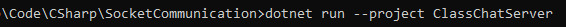
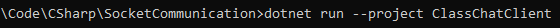
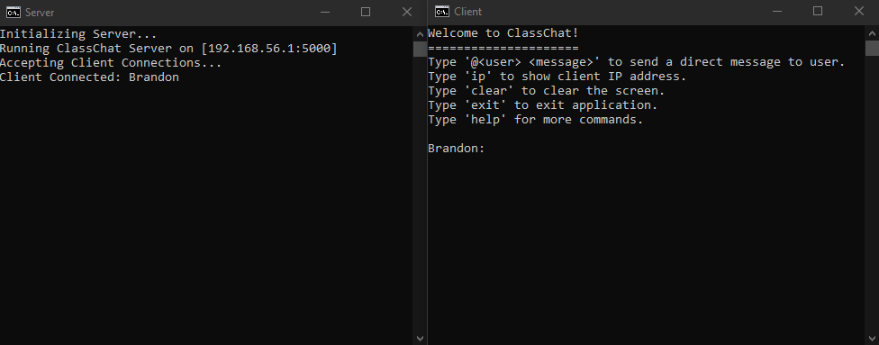

# ClassChat (Socket Programming Application)

## _**Application Setup**_
---

**This applciation was created using C# 10 (.NET 6), so to be able to run this application, ensure that you have the latest version of the .NET 6 SDK installed. (See Link Below)**

Download .NET 6.0 SDK: https://dotnet.microsoft.com/en-us/download

Once .NET 6.0 SDK is installed, open a console window in the _**SocketCommunication**_ directory.

_Note: Commands are based off of Windows command line, however, the dotnet CLI should still work cross-platform._

## _**Server**_

---

To run the server, use the following command: `dotnet run --project ClassChatServer`

In the event that the above command does not work, run the executable directly: `.\ClassChatServer\bin\Release\ClassChatServer.exe`

## _**Client**_

---

To run a client, use the following command: `dotnet run --project ClassChatClient`

In the event that the above command does not work, run the executable directly: `.\ClassChatClient\bin\Release\ClassChatClient.exe`

## _**Example Run**_

---

After successfully running a server and a client, the result would be the following:

_Note: For the client-side, it will ask for a username first before display the above interface. This example's client username was 'Brandon'._
